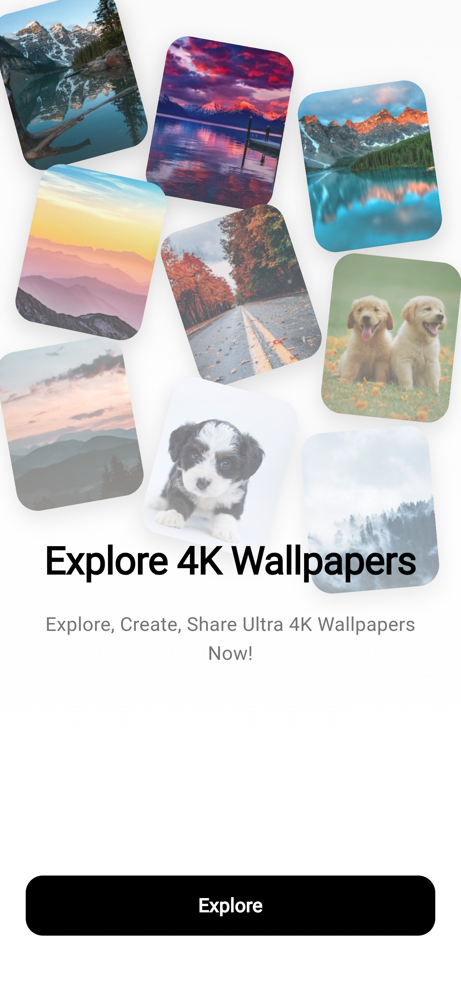
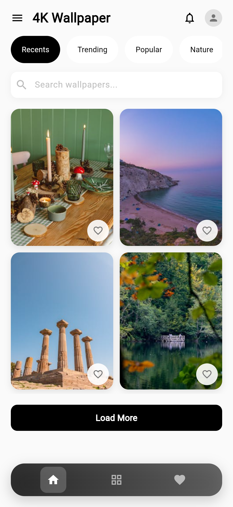

# VEKTOR - PEXELS WALLPAPER APP

Beautiful wallpaper application built using **Flutter** and **Pexels API**.
- High-Quality 4K Wallpaper Collection  
- Real-time Search and Discovery  
- One-Tap Wallpaper Setting

## Tech Stack

- **Flutter** (UI Framework)  
- **Pexels API** (Wallpaper data source)  
- **HTTP** (API communication)  
- **Flutter Wallpaper Manager** (Wallpaper setting)  
- **Flutter Cache Manager** (Image caching)  

## Screenshots

<div align="left">
  
    
  
</div>

## Dependencies

```yaml
flutter:
  sdk: flutter
http:
flutter_wallpaper_manager:
flutter_cache_manager:
cupertino_icons: ^1.0.2
flutter_launcher_icons: ^0.13.1
flutter_native_splash: ^2.3.7
```
